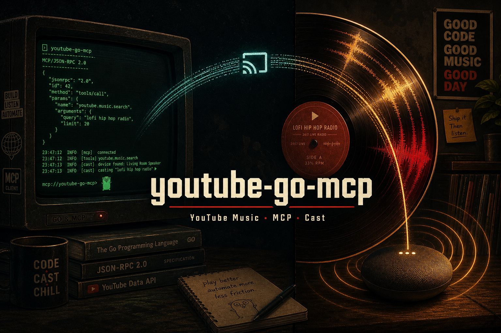

<p align="center">
  
</p>

# youtube-go-mcp

Static Go [MCP](https://modelcontextprotocol.io) server for **YouTube Music** search and library reads. Built so an AI agent can source tracks for Cast / Nest (or similar) playback workflows: this MCP returns `videoId`s; a separate Cast MCP (e.g. [mcp-beam](https://github.com/shotah/mcp-beam)) can play them.

Seeded from [raitonoberu/ytmusic](https://github.com/raitonoberu/ytmusic); rebranded and extended with browser auth + MCP tools.

## Tools (v1)

| Tool | Auth | Description |
|---|---|---|
| `search_tracks` | optional | Query → tracks with `videoId`, artists, cast URLs |
| `get_library_playlists` | required | Signed-in library playlists |
| `get_playlist` | depends | Playlist id → tracks (`LM` = Liked Songs) |
| `get_liked_songs` | required | Liked Songs for taste-aware suggestions |
| `get_history` | required | Recent listening history (with “Today” / “Yesterday” labels) |
| `get_watch_playlist` | optional | Radio / continuum from a seed `videoId` |
| `get_track` | optional | Track metadata; optional lyrics for song understanding |
| `get_lyrics` | optional | Plain-text lyrics when YouTube Music provides them |
| `format_cast_target` | no | `videoId` → URLs + hint to call mcp-beam `beam_youtube_video` |

## Build

```bash
make help          # all targets
make tools         # install goimports-reviser + golangci-lint v2
make check         # fmt + lint + short tests
make cli           # static binary → ./bin/youtube-go-mcp
make self-test
```

Release (tags `v*`, GoReleaser publishes binaries):

```bash
make release BUMP=patch   # or TAG=v0.2.0
```

## Auth (Premium / library)

Library tools need your browser session — not a YouTube Data API key.

```bash
./bin/youtube-go-mcp auth --out headers.json
# prompts for cookie + x-goog-authuser (from DevTools → Network → browse → Request Headers)
export YTMUSIC_HEADERS_PATH=$PWD/headers.json
./bin/youtube-go-mcp --self-test
```

1. Open [music.youtube.com](https://music.youtube.com) signed in
2. DevTools → **Network** → filter `browse` → click **Library**
3. Open the `browse` request → **Headers** → **Request Headers**
4. Copy **`cookie`** and **`x-goog-authuser`** when the CLI prompts

**Never commit `headers.json`.** Mount it as a secret when deploying (e.g. `secrets/ytmusic/headers.json`).

When library tools start failing with `session expired` / HTTP 401–403, re-export headers and restart the MCP. Full refresh guide: [docs/auth.md](docs/auth.md).

### Rate limits

InnerTube calls are spaced (`YTMUSIC_MIN_REQUEST_INTERVAL_MS`, default `250`) and HTTP **429/503** responses are retried with exponential backoff / `Retry-After` (`YTMUSIC_MAX_RETRIES`, default `3`).

## Run as MCP (stdio)

```bash
YTMUSIC_HEADERS_PATH=/path/to/headers.json ./bin/youtube-go-mcp
```

Logs go to **stderr** only — stdout is reserved for the MCP protocol.

Example Cursor / client config:

```json
{
  "mcpServers": {
    "ytmusic": {
      "command": "/usr/local/bin/youtube-go-mcp",
      "env": {
        "YTMUSIC_HEADERS_PATH": "/secrets/ytmusic/headers.json"
      }
    }
  }
}
```

## Cast contract

Returned tracks include:

- `videoId`
- `url` → `https://www.youtube.com/watch?v=…`
- `musicUrl` → `https://music.youtube.com/watch?v=…`

Cast integrations should target a **YouTube receiver by video ID**, not invent royalty-free MP3 fallbacks.

## Docker

```bash
docker build -t youtube-go-mcp .
```

Produces a static binary at `/usr/local/bin/youtube-go-mcp` (distroless-friendly).

## Develop

```bash
go test ./...
go vet ./...
make self-test
```

Client package: `internal/ytmusic`. MCP wiring: `internal/mcp` + `cmd/youtube-go-mcp`.

## License

MIT (see [LICENSE](LICENSE)).
