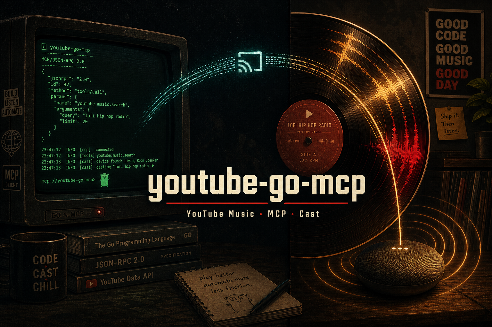

<p align="center">
  
</p>

# youtube-go-mcp

<p align="center">
  <a href="https://github.com/shotah/youtube-go-mcp/actions/workflows/ci.yml"></a>
  <a href="https://github.com/shotah/youtube-go-mcp/actions/workflows/release.yml"></a>
  <a href="https://github.com/shotah/youtube-go-mcp/actions/workflows/ci.yml"></a>
  <a href="https://pkg.go.dev/github.com/shotah/youtube-go-mcp"></a>
  
  <a href="LICENSE"></a>
</p>

Static Go [MCP](https://modelcontextprotocol.io) server for **YouTube Music** search and library reads. Built so an AI agent can source tracks for Cast / Nest (or similar) playback workflows: this MCP returns `videoId`s; a separate Cast MCP (e.g. [mcp-beam](https://github.com/shotah/mcp-beam)) can play them.

Seeded from [raitonoberu/ytmusic](https://github.com/raitonoberu/ytmusic); rebranded and extended with browser auth + MCP tools.

## Tools (v1)

| Tool | Auth | Description |
|---|---|---|
| `tracks_search` | optional | Query → tracks with `videoId`, artists, cast URLs |
| `library_list_playlists` | required | Signed-in library playlists |
| `playlists_get` | depends | Playlist id → tracks (`LM` = Liked Songs) |
| `library_list_liked_songs` | required | Liked Songs for taste-aware suggestions |
| `library_list_history` | required | Recent listening history (with “Today” / “Yesterday” labels) |
| `tracks_list_watch_playlist` | optional | Radio / continuum from a seed `videoId` |
| `tracks_get` | optional | Track metadata; optional lyrics for song understanding |
| `tracks_get_lyrics` | optional | Plain-text lyrics when YouTube Music provides them |
| `cast_format_target` | no | `videoId` / `video_id` + URLs + hint for mcp-beam `beam_youtube_video` |

Naming follows `{service}_{verb}_{object}` (same as google-mcp). On a host with server
id `youtube`, tools appear as e.g. `youtube__tracks_search`.

## Build

```bash
make help          # all targets
make tools         # install goimports-reviser + golangci-lint v2
make check         # fmt + lint + short tests
make cli           # static binary → ./bin/youtube-go-mcp
make self-test
```

Release (tags `v*`, GoReleaser publishes binaries):

```bash
make release BUMP=patch   # or TAG=v0.2.0
```

## Auth (Premium / library)

Library tools need the Google account that owns your YouTube Music Library /
Liked Songs. **Prefer OAuth** (survives normal browser logins). Cookies still
work but die when that session logs in again.

```bash
# Google Cloud: enable YouTube Data API v3 → OAuth client type "TVs and Limited Input devices"
export YTMUSIC_OAUTH_CLIENT_ID='….apps.googleusercontent.com'
export YTMUSIC_OAUTH_CLIENT_SECRET='…'
./bin/youtube-go-mcp auth oauth --out oauth.json
# Approve google.com/device as your *personal* Gmail (incognito if you have multiple accounts)
export YTMUSIC_OAUTH_PATH=$PWD/oauth.json
./bin/youtube-go-mcp --self-test
```

Gotchas (full detail in [docs/auth.md](docs/auth.md)):

- GCP project email ≠ which account the token uses — identity is whoever clicks
  **Allow** on the device page.
- Empty Liked Songs → run `auth oauth --whoami` and `auth oauth --probe-library`
  (wrong Google/Brand Account, or older binary missing visitor-id headers).
- Brand Account library: set `YTMUSIC_ON_BEHALF_OF_USER` (see auth docs).
- If both OAuth and `YTMUSIC_HEADERS_PATH` are set, **OAuth wins**.

Legacy cookies: `youtube-go-mcp auth browser --out headers.json` + `YTMUSIC_HEADERS_PATH`.

**Never commit `oauth.json` / `headers.json` / client secrets.**

### Rate limits

InnerTube calls are spaced (`YTMUSIC_MIN_REQUEST_INTERVAL_MS`, default `250`) and HTTP **429/503** responses are retried with exponential backoff / `Retry-After` (`YTMUSIC_MAX_RETRIES`, default `3`).

## Run as MCP (stdio)

```bash
YTMUSIC_OAUTH_PATH=/path/to/oauth.json \
YTMUSIC_OAUTH_CLIENT_ID=… \
YTMUSIC_OAUTH_CLIENT_SECRET=… \
./bin/youtube-go-mcp
```

Logs go to **stderr** only — stdout is reserved for the MCP protocol.

Example Cursor / client config:

```json
{
  "mcpServers": {
    "youtube": {
      "command": "/usr/local/bin/youtube-go-mcp",
      "env": {
        "YTMUSIC_OAUTH_PATH": "/secrets/ytmusic/oauth.json",
        "YTMUSIC_OAUTH_CLIENT_ID": "….apps.googleusercontent.com",
        "YTMUSIC_OAUTH_CLIENT_SECRET": "…"
      }
    }
  }
}
```

## Cast contract

Returned tracks include:

- `videoId`
- `url` → `https://www.youtube.com/watch?v=…`
- `musicUrl` → `https://music.youtube.com/watch?v=…`

Cast integrations should target a **YouTube receiver by video ID**, not invent royalty-free MP3 fallbacks.

## Docker

```bash
docker build -t youtube-go-mcp .
```

Produces a static binary at `/usr/local/bin/youtube-go-mcp` (distroless-friendly).

## Develop

```bash
make tools          # goimports-reviser + golangci-lint v2
make install-hooks  # pre-commit: fmt → lint → test + ≥70% coverage
make check          # same as the pre-commit hook
make coverage       # coverprofile for ./internal/... (fails under 70%)
make self-test
```

Coverage gate measures **`./internal/...`** — InnerTube client (`ytmusic`) + MCP tool surface (`mcp`). CLI / release helpers under `cmd/` are excluded on purpose.

CI builds, lints, enforces **≥70%** on that scope, and publishes a coverage badge to `gh-pages`.

## License

MIT (see [LICENSE](LICENSE)).
